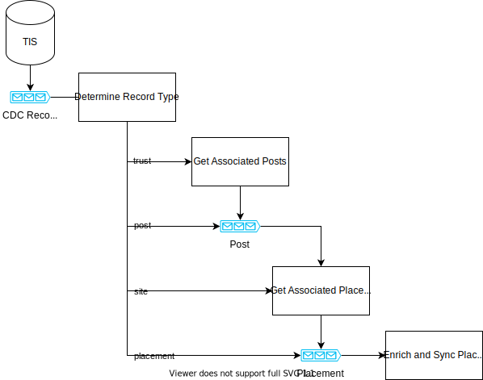

# TIS Trainee Sync

[![Build Status][build-badge]][build-href]
[![License][license-badge]][license-href]
[![Quality Gate Status][quality-gate-badge]][quality-gate-href]
[![Coverage Stats][coverage-badge]][coverage-href]

## About

This service handles synchronization of data from TIS Core to TIS Self Service.

### Placement Enrichment Flow

To synchronise a placement it must be enriched with additional data from several associated data
types. 

If these related data are not held in the sync database, then they are requested via messages 
posted to the ```REQUEST_QUEUE_URL``` queue.

Conversely, when an update is received for one of these data types, all associated placements must 
be updated and synchronised to reflect the changes. This is achieved by following the associations 
to find all placements needing an update and then queuing them to be processed as a placement load. 

Where the association between the modified record and the placement is indirect, such as 
```trust > post > placement```, then an intermediate queue is also used, in this case a `Post` 
queue is added. The queues for enabling these cascading data requests are:
- PLACEMENT_QUEUE_URL
- PLACEMENT_SPECIALTY_QUEUE_URL
- POST_QUEUE_URL

Note that, unlike trusts and posts, the load of a placement specialty does not trigger a request for 
its related placement, if this is not already in the sync database.




### Curriculum Membership Enrichment Flow

To synchronise a Curriculum Membership, it must be enriched with additional data from several
associated data types, namely Curriculum and Programme.

If these related data are not held in the sync database, then they are requested via messages
posted to the ```REQUEST_QUEUE_URL``` queue.

Conversely, when an update is received for one of these data types, all associated curriculum
memberships must be updated and synchronised to reflect the changes. This is achieved by following
the associations to find all curriculum memberships needing an update and then re-enriching them.

In addition, groups of similar [^1] Curriculum Membership records are processed together to
normalise the data into a single Programme Membership record and its constituent Curriculum
Memberships. Because the new parent Programme Membership has no distinct identity in the database, 
when a Curriculum Membership record is deleted, all the Curriculum Membership records for the 
trainee are re-sync'd to rebuild the normalised structure. This is necessary to avoid any stale
data persisting for the trainee in question.

### Full Person Data Refresh

This functionality allows the data for a specific person (trainee) to be requested, to refresh their
profile without doing a full data refresh as described [below](#data-refresh). 

When a message is received from the ```PROFILE_CREATED_QUEUE_URL``` queue, the listener posts a 
message on the ```REQUEST_QUEUE_URL``` queue, requesting data for the ```Person``` as a whole. It is 
expected that the service monitoring this queue 
(nominally [tis-sync](https://github.com/Health-Education-England/TIS-SYNC), though it could be any 
arbitrary service), will in turn respond by posting messages containing all related data for the 
person to the ```RECORD_QUEUE_URL``` queue.

### Reference Data

When the message read from the ```RECORD_QUEUE_URL``` queue contains reference data (e.g. DBC, 
Gender), then it is not stored in the sync database itself, but is submitted to the reference 
service (nominally 
[trainee-reference](https://github.com/Health-Education-England/tis-trainee-reference)). This is 
done using the reference service API, not a message queue.

### Sync'ing Data to Trainee Details

Once a data record has been enriched with all its related data, it is sync'd to Trainee Details
(nominally [trainee-details](https://github.com/Health-Education-England/tis-trainee-details)) using
the API endpoints constructed from ```TRAINEE_DETAILS_HOST``` and ```TRAINEE_DETAILS_PORT```. This 
includes placements and curriculum memberships, as described in more detail above, as well as and 
the personal details of the trainee that are used to create the trainee profile in the first place.

## Operational Support

### Force a Data Refresh {#data-refresh}

The model/dto packages describe the entities that are received by the single API endpoint. Each of
this can be reloaded in full:

1. Agree a time to trigger the load, as doing so will increase the latency in normal data migration.
2. Log into the web console
3. Go to the "Database Migration Service"
4. Select the task describing the source and target
5. Go to "Table Statistics" page
6. Select the Entity Type(s) to be refreshed and press "Reload table data"

## Developing

### Running

```shell
gradlew bootRun
```

#### Pre-Requisites

- A MongoDB instance.
- Access to queues as listed below. This can be achieved via configuring
  - an instance of [localstack](https://localstack.cloud/), or
  - AWS SQS


#### Environmental Variables

| Name                            | Description                                               | Default   |
|---------------------------------|-----------------------------------------------------------|-----------|
| **Database:**                   |                                                           |           |
| DB_HOST                         | The MongoDB host to connect to.                           | localhost |
| DB_PORT                         | The port to connect to MongoDB on.                        | 27017     |
| DB_NAME                         | The name of the MongoDB database.                         | sync      |
| DB_USER                         | The username to access the MongoDB instance.              | admin     |
| DB_PASSWORD                     | The password to access the MongoDB instance.              | pwd       |
| AUTH_SOURCE                     | The authentication database.                              | admin     |
| **Logging:**                    |                                                           |           |
| SENTRY_DSN                      | A Sentry error monitoring Data Source Name.               |           |
| ENVIRONMENT                     | The environment to log events against.                    | local     |
| LOGGING_ROOT                    | Root logging level.                                       | INFO      |
| LOGGING_EVENT                   | Sync event logging level.                                 | DEBUG     |
| LOGGING_SERVICE                 | Sync service logging level.                               | DEBUG     |
| **Queues:**                     |                                                           |           |
| CURRICULUM_MEMBERSHIP_QUEUE_URL | Queue to receive curriculum memberships.                  |           |
| PLACEMENT_QUEUE_URL             | Queue to receive related placements.                      |           |
| PLACEMENT_SPECIALTY_QUEUE_URL   | Queue to receive related placement specialties.           |           |
| PROFILE_CREATED_QUEUE_URL       | Queue to receive profile creation notifications.          |           |
| POST_QUEUE_URL                  | Queue to receive related posts.                           |           |
| RECORD_QUEUE_URL                | Queue to receive general data records of different types. |           |
| REQUEST_QUEUE_URL               | Queue to request data from TIS.                           |           |
| **Related services:**           |                                                           |           |
| REFERENCE_HOST                  | Reference service host.                                   | localhost |
| REFERENCE_PORT                  | Reference service port.                                   | 8205      |
| TRAINEE_DETAILS_HOST            | Trainee details service host.                             | localhost |
| TRAINEE_DETAILS_PORT            | Trainee details service port.                             | 8203      |


### Usage Examples

The service responds to available messages on the queues from which it reads. The default polling 
interval is used (i.e. polling is done once all threads are free). The examples below use localstack
to post messages, but the equivalent example using AWS SQS would mean simply posting the 
```message-body``` content to the appropriate queue.

#### Load a Record (e.g. a placement)
```
awslocal sqs send-message --queue-url {RECORD_QUEUE_URL} --message-body '{"data":{"id":"1632184","dateFrom":"2019-04-03","dateTo":"2019-08-06","wholeTimeEquivalent":"1.0","traineeId":"1234","postId":"1136","gradeAbbreviation":"F2","placementType":"In Post","gradeId":"338","siteId":"4297"},"metadata":{"timestamp":"2022-06-23T13:00:43.879686Z","record-type":"data","operation":"load","partition-key-type":"schema-table","schema-name":"tcs","table-name":"Placement","transaction-id":"e0e7bc05-b942-4b53-a587-dbda8a1a8d90"}}'
```

#### Delete a Record (e.g. a curriculum)
```
awslocal sqs send-message --queue-url {RECORD_QUEUE_URL} --message-body '{ "data": { "id" : 408 }, "metadata": { "timestamp": "2021-01-14T11:50:17.133721Z", "record-type": "data", "operation": "delete", "partition-key-type": "primary-key", "schema-name": "tcs", "table-name": "Curriculum" } }'
```

#### Service Health

Spring Actuator is included to provide health check and info endpoints, which can be accessed
at `<host>:<port>/sync/actuator/health` and
`<host>:<port>/sync/actuator/info` respectively.

### Testing

The Gradle `test` task can be used to run automated tests and produce coverage
reports.
```shell
gradlew test
```

The Gradle `check` lifecycle task can be used to run automated tests and also
verify formatting conforms to the code style guidelines.
```shell
gradlew check
```

### Building

```shell
gradlew bootBuildImage
```

## Versioning

This project uses [Semantic Versioning](https://semver.org).

## License

This project is licensed under [The MIT License (MIT)](LICENSE).

[coverage-badge]: https://sonarcloud.io/api/project_badges/measure?project=Health-Education-England_tis-trainee-sync&metric=coverage

[coverage-href]: https://sonarcloud.io/component_measures?metric=coverage&id=Health-Education-England_tis-trainee-sync

[build-badge]: https://badgen.net/github/checks/health-education-england/tis-trainee-sync?label=build&icon=github

[build-href]: https://github.com/Health-Education-England/tis-trainee-sync/actions/workflows/ci-cd-workflow.yml

[license-badge]: https://badgen.net/github/license/health-education-england/tis-trainee-sync

[license-href]: LICENSE

[quality-gate-badge]: https://sonarcloud.io/api/project_badges/measure?project=Health-Education-England_tis-trainee-sync&metric=alert_status

[quality-gate-href]: https://sonarcloud.io/summary/new_code?id=Health-Education-England_tis-trainee-sync

[^1]: 'Similar' means that they share a common trainee, programme, programme membership type and 
programme start and end date. They effectively represent the curriculum memberships within a single
(denormalised) programme membership entity.
